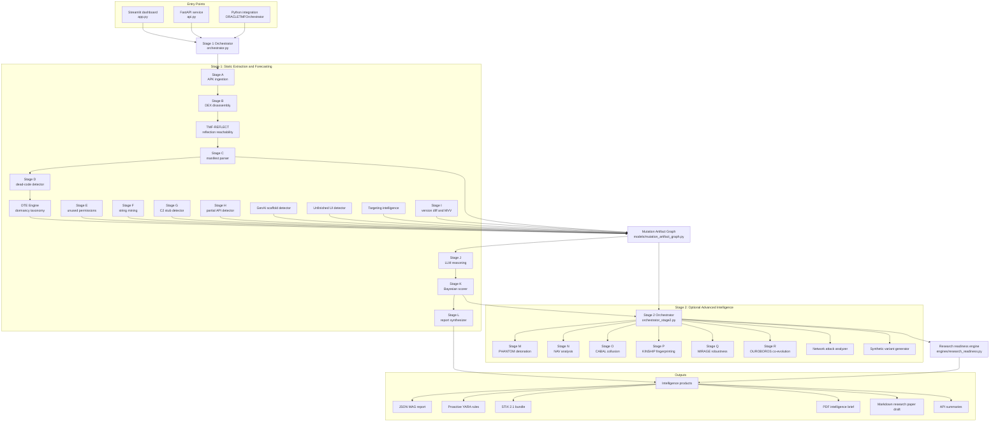

# ORACLE-TMF

Observational Reasoning and Coercive Analysis for Latent Evolution - Temporal Mutation Forecaster.

ORACLE-TMF is a defensive Android malware analysis and mutation-forecasting platform. It extracts dormant implementation signals from APKs, converts them into a canonical Mutation Artifact Graph (MAG), reasons over those signals, scores next-version forecasts, and exports actionable intelligence for analysts, SOC teams, and research workflows.

The project is built around one core idea: malware often contains evidence of what it will become before the next version is released. Dead code, unused permissions, inactive C2 clients, partial APIs, unfinished UI flows, placeholder strings, and GenAI scaffolds can reveal the attacker workflow, planned capability, and likely next development step.

Safety scope: ORACLE-TMF is intended for malware analysis, threat intelligence, detection engineering, and defensive research. Lab-only modules such as PHANTOM and OUROBOROS should be used only in controlled, isolated environments.

---

## Table of Contents

- [High-Level Capabilities](#high-level-capabilities)
- [Architecture Flowchart](#architecture-flowchart)
- [Repository Layout](#repository-layout)
- [Core Data Model: Mutation Artifact Graph](#core-data-model-mutation-artifact-graph)
- [Stage 1 Pipeline: Static Extraction and Forecasting](#stage-1-pipeline-static-extraction-and-forecasting)
- [Stage 2 Pipeline: Advanced Intelligence Engines](#stage-2-pipeline-advanced-intelligence-engines)
- [Research Readiness and Paper Drafting](#research-readiness-and-paper-drafting)
- [Outputs and Intelligence Products](#outputs-and-intelligence-products)
- [Dashboard Usage](#dashboard-usage)
- [REST API Usage](#rest-api-usage)
- [Python API Usage](#python-api-usage)
- [Installation](#installation)
- [Configuration](#configuration)
- [Testing](#testing)
- [Security and Safety Model](#security-and-safety-model)
- [Troubleshooting](#troubleshooting)
- [Development Notes](#development-notes)
- [Disclaimer](#disclaimer)

---

## High-Level Capabilities

ORACLE-TMF combines static APK inspection, graph-style artifact modeling, optional LLM reasoning, Bayesian scoring, and Stage 2 research engines.

Primary capabilities:

- APK metadata extraction: package name, versions, hashes, certificates, SDK levels, entry points, packer hints, and file size.
- DEX and CFG analysis: extracts Android bytecode structure through Androguard and graph traversal.
- Seven-class mutation artifact taxonomy: dead code, unused permissions, placeholder strings, C2 stubs, partial APIs, unfinished UI flows, and GenAI scaffolds.
- Dormancy Taxonomy Engine (DTE): classifies unreachable code into labels such as `REMNANT`, `SCAFFOLDING`, `LOGIC_BOMB`, and `ENCRYPTED_DROPPER`.
- TMF-REFLECT: augments control-flow reachability with reflection and dynamic loading chains.
- Multi-agent LLM reasoning: decompilation, hypothesis generation, and skeptical validation.
- RAG grounding: optional ChromaDB and sentence-transformers retrieval over MITRE ATT&CK Mobile and malware-family context.
- Bayesian scoring: fuses LLM probability, artifact density, mutation velocity, and historical prior.
- Stage 2 intelligence: NAV, PHANTOM, CABAL, KINSHIP, MIRAGE, OUROBOROS, synthetic variants, and network attack detection.
- Research-readiness scoring: converts analysis output into evidence matrices, limitations, reproducibility checks, and paper-ready summaries.
- Export pack: JSON, YARA, STIX 2.1, PDF brief, and Markdown research paper draft.
- Streamlit dashboard: analyst-facing interactive UI.
- FastAPI service: authenticated upload and result retrieval API with safe defaults.

---

## Architecture Flowchart

The platform has three main entry points: the Streamlit dashboard, the FastAPI service, and direct Python orchestration. All entry points feed the same Stage 1 orchestrator and optionally the Stage 2 orchestrator.



Stage 1 builds evidence. Stage 2 enriches it. Stage L and the research-readiness engine turn it into consumable intelligence.

---

## Repository Layout

```text
.
|-- app.py                              Streamlit analyst dashboard
|-- api.py                              FastAPI service with auth, rate limits, TTL result cache
|-- orchestrator.py                     Main Stage 1 orchestration path
|-- orchestrator_stage2.py              Optional Stage 2 orchestration path
|-- security.py                         Upload validation, API key checks, sanitization helpers
|-- requirements.txt                    Runtime, dashboard, API, Stage 2, and test dependencies
|-- STAGE2_INTEGRATION.md               Stage 2 integration notes
|-- config/
|   |-- settings.py                     Stage 1 constants, thresholds, API settings
|   `-- stage2_settings.py              Stage 2 constants and lab-module defaults
|-- data/
|   `-- knowledge_base/                 MITRE, malware-family, and targeting taxonomy data
|-- engines/
|   |-- dte_engine.py                   Dormancy Taxonomy Engine
|   |-- tmf_reflect.py                  Reflection-aware CFG augmentation
|   |-- genai_scaffold_detector.py      GenAI/LLM API scaffold detector
|   |-- unfinished_ui_detector.py       Orphaned layout and UI-flow detector
|   |-- targeting_intelligence.py       Institution and region targeting hints
|   |-- research_readiness.py           Publication and evidence-quality scoring
|   `-- nav/nav_engine.py               Negative Artifact Vector engine
|-- models/
|   |-- mutation_artifact_graph.py      Canonical MAG dataclasses
|   `-- nav_models.py                   NAV event and history models
|-- phantom/                            PHANTOM dynamic/deception components
|   |-- deception_engine.py
|   |-- device_persona.py
|   |-- honeytoken_generator.py
|   |-- sensory_emulation.py
|   |-- behavioral_biometrics.py
|   `-- frida_bypass/
|-- pipeline/
|   |-- stage_a_ingestion.py            APK hashing, metadata, extraction
|   |-- stage_b_dex_disassembly.py      Androguard DEX analysis
|   |-- stage_c_manifest_parser.py      Manifest parsing
|   |-- stage_d_dead_code.py            Unreachable code discovery
|   |-- stage_e_unused_perms.py         Permission/API mismatch analysis
|   |-- stage_f_string_mining.py        Placeholder, entropy, URL, crypto, and marker mining
|   |-- stage_g_c2_stubs.py             Dormant network client extraction
|   |-- stage_h_partial_apis.py         Incomplete sensitive API implementation detection
|   |-- stage_i_version_diff.py         Version delta and mutation velocity vector
|   |-- stage_j_llm_reasoning.py        Three-agent LLM reasoning chain
|   |-- stage_k_bayesian_scorer.py      Confidence scoring and gating
|   |-- stage_l_report_synthesizer.py   JSON, YARA, STIX, PDF, and paper output
|   `-- stage2/                         Stage M-R wrappers
|-- research/
|   |-- cabal/                          Cross-app collusion analysis
|   |-- kinship/                        Builder DNA fingerprinting
|   |-- mirage/                         Adversarial robustness analysis
|   |-- network_attack/                 DDoS, DGA, and network signature detection
|   |-- ouroboros/                      Co-evolution and prompt refinement loop
|   `-- synthetic_variant/              Synthetic v(n+1) variant fixtures
`-- tests/                              Unit and contract tests
```

---

## Core Data Model: Mutation Artifact Graph

The Mutation Artifact Graph (MAG) is the canonical object passed between stages. It is defined in `models/mutation_artifact_graph.py`.

A MAG stores:

- `apk_metadata`: hashes, package metadata, version info, certificate metadata, SDK levels, entry points, packer hints.
- `dead_code`: unreachable method artifacts found by Stage D and labeled by DTE.
- `unused_permissions`: permissions requested in the manifest but not matched to expected runtime API usage.
- `placeholder_strings`: staging markers, TODO/FIXME strings, local URLs, internal IPs, high-entropy strings, crypto addresses, and similar development leftovers.
- `c2_stubs`: inactive or orphaned command-and-control plumbing.
- `partial_apis`: incomplete implementations of sensitive framework classes.
- `unfinished_ui_flows`: orphaned layouts, dormant screens, phishing-like layouts, and unreferenced UI assets.
- `genai_scaffolds`: references to GenAI providers, model hints, and API endpoints.
- `manifest`: parsed manifest fields and targeting extensions.
- `version_delta`: artifact additions/removals and Mutation Velocity Vector (MVV) when a previous APK is supplied.
- `forecasts`: next-version mutation forecasts generated by Stage J and scored by Stage K.
- `stage2_intelligence`: stable Stage 2 summary used by the UI, API, reports, and paper drafts.
- `research_readiness`: evidence-quality and publication-readiness report.
- `stage_errors`: per-stage error capture so one failed stage does not destroy the whole analysis.
- `stage_timings_ms`: per-stage timing telemetry.

The MAG can be serialized with:

```python
mag.to_dict()
mag.to_json()
```

It can also be reconstructed from saved JSON:

```python
from models.mutation_artifact_graph import MutationArtifactGraph

mag = MutationArtifactGraph.from_dict(saved_report["full_mag"])
```
