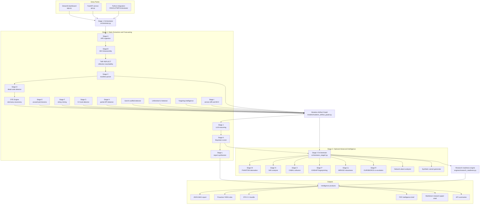
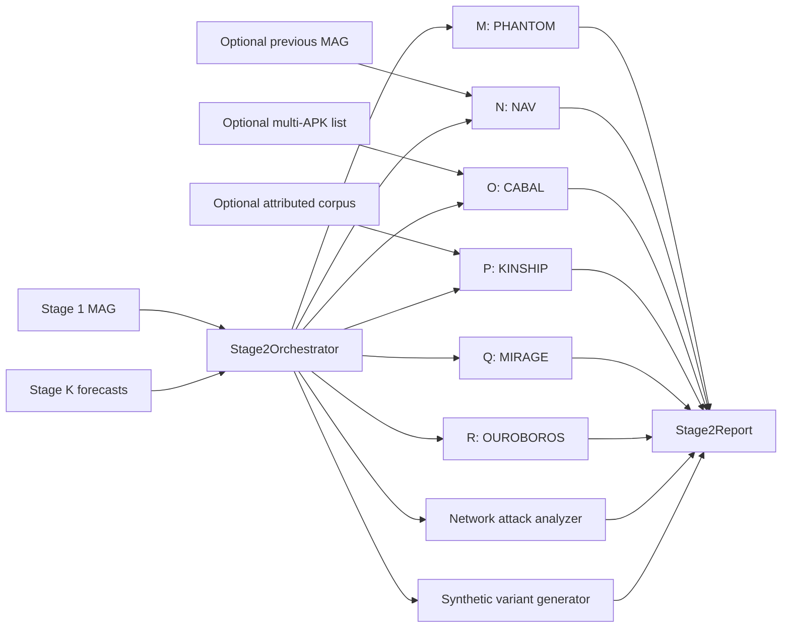

# ORACLE-TMF

Observational Reasoning and Coercive Analysis for Latent Evolution - Temporal Mutation Forecaster.

ORACLE-TMF is a defensive Android malware analysis and mutation-forecasting platform. It extracts dormant implementation signals from APKs, converts them into a canonical Mutation Artifact Graph (MAG), reasons over those signals, scores next-version forecasts, and exports actionable intelligence for analysts, SOC teams, and research workflows.

The project is built around one core idea: malware often contains evidence of what it will become before the next version is released. Dead code, unused permissions, inactive C2 clients, partial APIs, unfinished UI flows, placeholder strings, and GenAI scaffolds can reveal the attacker workflow, planned capability, and likely next development step.

Safety scope: ORACLE-TMF is intended for malware analysis, threat intelligence, detection engineering, and defensive research. Lab-only modules such as PHANTOM and OUROBOROS should be used only in controlled, isolated environments.

---

## Table of Contents

- [High-Level Capabilities](#high-level-capabilities)
- [Architecture Flowchart](#architecture-flowchart)
- [Repository Layout](#repository-layout)
- [Core Data Model: Mutation Artifact Graph](#core-data-model-mutation-artifact-graph)
- [Stage 1 Pipeline: Static Extraction and Forecasting](#stage-1-pipeline-static-extraction-and-forecasting)
- [Stage 2 Pipeline: Advanced Intelligence Engines](#stage-2-pipeline-advanced-intelligence-engines)
- [Research Readiness and Paper Drafting](#research-readiness-and-paper-drafting)
- [Outputs and Intelligence Products](#outputs-and-intelligence-products)
- [Dashboard Usage](#dashboard-usage)
- [REST API Usage](#rest-api-usage)
- [Python API Usage](#python-api-usage)
- [Installation](#installation)
- [Configuration](#configuration)
- [Testing](#testing)
- [Security and Safety Model](#security-and-safety-model)
- [Troubleshooting](#troubleshooting)
- [Development Notes](#development-notes)
- [Disclaimer](#disclaimer)

---

## High-Level Capabilities

ORACLE-TMF combines static APK inspection, graph-style artifact modeling, optional LLM reasoning, Bayesian scoring, and Stage 2 research engines.

Primary capabilities:

- APK metadata extraction: package name, versions, hashes, certificates, SDK levels, entry points, packer hints, and file size.
- DEX and CFG analysis: extracts Android bytecode structure through Androguard and graph traversal.
- Seven-class mutation artifact taxonomy: dead code, unused permissions, placeholder strings, C2 stubs, partial APIs, unfinished UI flows, and GenAI scaffolds.
- Dormancy Taxonomy Engine (DTE): classifies unreachable code into labels such as `REMNANT`, `SCAFFOLDING`, `LOGIC_BOMB`, and `ENCRYPTED_DROPPER`.
- TMF-REFLECT: augments control-flow reachability with reflection and dynamic loading chains.
- Multi-agent LLM reasoning: decompilation, hypothesis generation, and skeptical validation.
- RAG grounding: optional ChromaDB and sentence-transformers retrieval over MITRE ATT&CK Mobile and malware-family context.
- Bayesian scoring: fuses LLM probability, artifact density, mutation velocity, and historical prior.
- Stage 2 intelligence: NAV, PHANTOM, CABAL, KINSHIP, MIRAGE, OUROBOROS, synthetic variants, and network attack detection.
- Research-readiness scoring: converts analysis output into evidence matrices, limitations, reproducibility checks, and paper-ready summaries.
- Export pack: JSON, YARA, STIX 2.1, PDF brief, and Markdown research paper draft.
- Streamlit dashboard: analyst-facing interactive UI.
- FastAPI service: authenticated upload and result retrieval API with safe defaults.

---

## Architecture Flowchart

The platform has three main entry points: the Streamlit dashboard, the FastAPI service, and direct Python orchestration. All entry points feed the same Stage 1 orchestrator and optionally the Stage 2 orchestrator.



Stage 1 builds evidence. Stage 2 enriches it. Stage L and the research-readiness engine turn it into consumable intelligence.

---

## Repository Layout

```text
.
|-- app.py                              Streamlit analyst dashboard
|-- api.py                              FastAPI service with auth, rate limits, TTL result cache
|-- orchestrator.py                     Main Stage 1 orchestration path
|-- orchestrator_stage2.py              Optional Stage 2 orchestration path
|-- security.py                         Upload validation, API key checks, sanitization helpers
|-- requirements.txt                    Runtime, dashboard, API, Stage 2, and test dependencies
|-- STAGE2_INTEGRATION.md               Stage 2 integration notes
|-- config/
|   |-- settings.py                     Stage 1 constants, thresholds, API settings
|   `-- stage2_settings.py              Stage 2 constants and lab-module defaults
|-- data/
|   `-- knowledge_base/                 MITRE, malware-family, and targeting taxonomy data
|-- engines/
|   |-- dte_engine.py                   Dormancy Taxonomy Engine
|   |-- tmf_reflect.py                  Reflection-aware CFG augmentation
|   |-- genai_scaffold_detector.py      GenAI/LLM API scaffold detector
|   |-- unfinished_ui_detector.py       Orphaned layout and UI-flow detector
|   |-- targeting_intelligence.py       Institution and region targeting hints
|   |-- research_readiness.py           Publication and evidence-quality scoring
|   `-- nav/nav_engine.py               Negative Artifact Vector engine
|-- models/
|   |-- mutation_artifact_graph.py      Canonical MAG dataclasses
|   `-- nav_models.py                   NAV event and history models
|-- phantom/                            PHANTOM dynamic/deception components
|   |-- deception_engine.py
|   |-- device_persona.py
|   |-- honeytoken_generator.py
|   |-- sensory_emulation.py
|   |-- behavioral_biometrics.py
|   `-- frida_bypass/
|-- pipeline/
|   |-- stage_a_ingestion.py            APK hashing, metadata, extraction
|   |-- stage_b_dex_disassembly.py      Androguard DEX analysis
|   |-- stage_c_manifest_parser.py      Manifest parsing
|   |-- stage_d_dead_code.py            Unreachable code discovery
|   |-- stage_e_unused_perms.py         Permission/API mismatch analysis
|   |-- stage_f_string_mining.py        Placeholder, entropy, URL, crypto, and marker mining
|   |-- stage_g_c2_stubs.py             Dormant network client extraction
|   |-- stage_h_partial_apis.py         Incomplete sensitive API implementation detection
|   |-- stage_i_version_diff.py         Version delta and mutation velocity vector
|   |-- stage_j_llm_reasoning.py        Three-agent LLM reasoning chain
|   |-- stage_k_bayesian_scorer.py      Confidence scoring and gating
|   |-- stage_l_report_synthesizer.py   JSON, YARA, STIX, PDF, and paper output
|   `-- stage2/                         Stage M-R wrappers
|-- research/
|   |-- cabal/                          Cross-app collusion analysis
|   |-- kinship/                        Builder DNA fingerprinting
|   |-- mirage/                         Adversarial robustness analysis
|   |-- network_attack/                 DDoS, DGA, and network signature detection
|   |-- ouroboros/                      Co-evolution and prompt refinement loop
|   `-- synthetic_variant/              Synthetic v(n+1) variant fixtures
`-- tests/                              Unit and contract tests
```

---

## Core Data Model: Mutation Artifact Graph

The Mutation Artifact Graph (MAG) is the canonical object passed between stages. It is defined in `models/mutation_artifact_graph.py`.

A MAG stores:

- `apk_metadata`: hashes, package metadata, version info, certificate metadata, SDK levels, entry points, packer hints.
- `dead_code`: unreachable method artifacts found by Stage D and labeled by DTE.
- `unused_permissions`: permissions requested in the manifest but not matched to expected runtime API usage.
- `placeholder_strings`: staging markers, TODO/FIXME strings, local URLs, internal IPs, high-entropy strings, crypto addresses, and similar development leftovers.
- `c2_stubs`: inactive or orphaned command-and-control plumbing.
- `partial_apis`: incomplete implementations of sensitive framework classes.
- `unfinished_ui_flows`: orphaned layouts, dormant screens, phishing-like layouts, and unreferenced UI assets.
- `genai_scaffolds`: references to GenAI providers, model hints, and API endpoints.
- `manifest`: parsed manifest fields and targeting extensions.
- `version_delta`: artifact additions/removals and Mutation Velocity Vector (MVV) when a previous APK is supplied.
- `forecasts`: next-version mutation forecasts generated by Stage J and scored by Stage K.
- `stage2_intelligence`: stable Stage 2 summary used by the UI, API, reports, and paper drafts.
- `research_readiness`: evidence-quality and publication-readiness report.
- `stage_errors`: per-stage error capture so one failed stage does not destroy the whole analysis.
- `stage_timings_ms`: per-stage timing telemetry.

The MAG can be serialized with:

```python
mag.to_dict()
mag.to_json()
```

It can also be reconstructed from saved JSON:

```python
from models.mutation_artifact_graph import MutationArtifactGraph

mag = MutationArtifactGraph.from_dict(saved_report["full_mag"])
```

---

## Stage 1 Pipeline: Static Extraction and Forecasting

Stage 1 is coordinated by `ORACLETMFOrchestrator` in `orchestrator.py`. It is designed to be resilient: each stage is wrapped in `_run_stage`, failures are recorded in `mag.stage_errors`, and downstream stages receive safe defaults when possible.

### Stage A: APK Ingestion

File: `pipeline/stage_a_ingestion.py`

Responsibilities:

- Validate and extract the APK into a working directory.
- Compute SHA-256, MD5, and fuzzy hash metadata where supported.
- Parse certificate metadata.
- Detect packer indicators.
- Record package, version, SDK, and file-size fields in `APKMetadata`.

Output:

- `APKMetadata`
- extracted working directory path

### Stage B: DEX Disassembly

File: `pipeline/stage_b_dex_disassembly.py`

Responsibilities:

- Load the APK with Androguard.
- Build DEX analysis objects.
- Build CFG-like structures used by reachability analysis.
- Provide the low-level bytecode and method graph context for later stages.

Output:

- Androguard analysis object
- CFG/helper graph object

### TMF-REFLECT: Reflection Reachability Augmentation

File: `engines/tmf_reflect.py`

Responsibilities:

- Identify reflective method loading and dynamic class loading.
- Improve reachability analysis so reflected code is not incorrectly treated as dead.
- Reduce false positives from Android malware that hides calls behind `Class.forName`, `Method.invoke`, and loader chains.

Output:

- augmented CFG/reachability context

### Stage C: Manifest Parser

File: `pipeline/stage_c_manifest_parser.py`

Responsibilities:

- Parse `AndroidManifest.xml` safely.
- Extract package identifiers, permissions, services, receivers, activities, intent filters, SDK metadata, and entry points.
- Feed permission and component context into later stages.

Output:

- manifest dictionary stored in `mag.manifest`

### Stage D: Dead Code Detector

File: `pipeline/stage_d_dead_code.py`

Responsibilities:

- Discover methods that are not reachable from known Android lifecycle, component, and callback entry points.
- Exclude common lifecycle boilerplate.
- Preserve raw Smali snippets, method names, class names, and opcode counts.

Output:

- `DeadCodeArtifact` records in `mag.dead_code`

### DTE: Dormancy Taxonomy Engine

File: `engines/dte_engine.py`

Responsibilities:

- Classify dead code into dormancy labels:
  - `REMNANT`: likely abandoned or benign leftover code.
  - `SCAFFOLDING`: future capability implementation scaffold.
  - `LOGIC_BOMB`: dormant conditional behavior.
  - `ENCRYPTED_DROPPER`: packed or encrypted staged payload logic.
- Use features such as trigger depth, guard entropy, API sensitivity, guard indegree, and opcode count.

Output:

- enriched `DeadCodeArtifact` objects with DTE labels and confidence values.

### Stage E: Unused Permission Analyzer

File: `pipeline/stage_e_unused_perms.py`

Responsibilities:

- Compare requested Android permissions against observed API usage.
- Identify permissions that are requested but not exercised in the current code path.
- Highlight future capability preparation, especially SMS, contacts, accessibility, device admin, overlay, camera, microphone, and location permissions.

Output:

- `UnusedPermissionArtifact` records in `mag.unused_permissions`

### Stage F: String Miner

File: `pipeline/stage_f_string_mining.py`

Responsibilities:

- Extract strings from APK resources and code context.
- Detect placeholder markers such as TODO, FIXME, debug, dev, staging, sandbox, local URLs, RFC1918 IPs, hardcoded IPv4/IPv6 values, `.onion` addresses, crypto addresses, and C2-like paths.
- Score entropy for suspicious opaque strings.

Output:

- `PlaceholderStringArtifact` records in `mag.placeholder_strings`

### Stage G: C2 Stub Detector

File: `pipeline/stage_g_c2_stubs.py`

Responsibilities:

- Inspect dead code and analysis context for inactive network clients.
- Detect frameworks such as OkHttp, Retrofit, Volley, HttpURLConnection, Apache HttpClient, and URL streams.
- Extract URLs, methods, payload schemas, and framework hints.

Output:

- `C2EndpointStubArtifact` records in `mag.c2_stubs`

### Stage H: Partial API Detector

File: `pipeline/stage_h_partial_apis.py`

Responsibilities:

- Identify incomplete sensitive Android framework implementations.
- Look for classes extending or implementing accessibility services, device admin receivers, phone listeners, broadcast receivers, input methods, and notification listeners.
- Detect method stubs and low-opcode incomplete implementations.

Output:

- `PartialAPIArtifact` records in `mag.partial_apis`

### GenAI Scaffold Detector

File: `engines/genai_scaffold_detector.py`

Responsibilities:

- Detect evidence of GenAI or LLM API integration scaffolding.
- Identify provider names, model hints, endpoints, and dormant code that suggests dynamic prompt or payload generation.

Output:

- `GenAIAPIScaffoldArtifact` records in `mag.genai_scaffolds`

### Unfinished UI Detector

File: `engines/unfinished_ui_detector.py`

Responsibilities:

- Inspect layouts, resources, and UI references.
- Identify orphaned layouts and dormant screens.
- Flag UI flows that resemble credential capture, phishing overlays, or unreferenced banking screens.

Output:

- `UnfinishedUIFlowArtifact` records in `mag.unfinished_ui_flows`

### Targeting Intelligence

File: `engines/targeting_intelligence.py`

Responsibilities:

- Compare package names, resources, strings, and UI hints against banking/package taxonomies.
- Infer probable malware family hints, target institutions, and geographic expansion signals.
- Attach targeting evidence to forecasts when Stage J/K produce predictions.

Output:

- targeting summary stored under `mag.manifest["_targeting"]`
- optional forecast target institution and country enrichment

### Stage I: Version Diff and Mutation Velocity Vector

File: `pipeline/stage_i_version_diff.py`

Responsibilities:

- Compare the current MAG (`v_n`) against a previous MAG (`v_n-1`) when a prior APK is supplied.
- Track artifacts added and removed across versions.
- Compute edit distance and MVV normalization.
- Feed MVV into Stage K confidence scoring.

Output:

- `VersionDelta` stored in `mag.version_delta`

### Stage J: Multi-Agent LLM Reasoning

File: `pipeline/stage_j_llm_reasoning.py`

Stage J is optional. It runs when `skip_llm=False` and an Anthropic client can be initialized.

It uses three sequential agents:

1. Decompiler agent: turns top DTE-scaffolding Smali snippets into pseudo-Java and API summaries.
2. Hypothesizer agent: maps the MAG into a single most likely next-version MITRE ATT&CK Mobile capability.
3. Skeptical validator agent: challenges the hypothesis, checks for boilerplate, verifies specificity and convergence, and assigns `P_LLM`.

RAG grounding:

- ChromaDB persistent store path is configured in `config/settings.py`.
- Collections include MITRE ATT&CK Mobile and malware-family context.
- Sentence-BERT is used for semantic retrieval when available.

Output:

- list of `MutationForecast` objects with LLM probability and rationale.

### Stage K: Bayesian Scorer

File: `pipeline/stage_k_bayesian_scorer.py`

Stage K scores each forecast using:

```text
C = 0.45 * P_LLM + 0.35 * D_artifact * MVV_norm + 0.20 * H_prior
```

Where:

- `P_LLM`: validator probability from Stage J.
- `D_artifact`: multi-artifact convergence score.
- `MVV_norm`: mutation velocity normalization from Stage I, clipped by configured bounds.
- `H_prior`: historical prior from RAG when available, otherwise a default prior.

The default confidence gate is:

```text
CONFIDENCE_GATE_THRESHOLD = 0.72
```

Output:

- sorted and scored forecasts in `mag.forecasts`
- `passes_gate=True` for forecasts above the configured threshold

### Stage L: Report Synthesizer

File: `pipeline/stage_l_report_synthesizer.py`

Responsibilities:

- Generate independent report artifacts.
- Avoid total pipeline failure when one output format fails.
- Redact secrets and sanitize report text.
- Purge stale report files according to `ORACLE_TMF_REPORT_TTL_SECONDS`.

Output:

- `ReportBundle` with paths for JSON, YARA, STIX, PDF, Markdown paper draft, and per-format errors.

---

## Stage 2 Pipeline: Advanced Intelligence Engines

Stage 2 is coordinated by `Stage2Orchestrator` in `orchestrator_stage2.py`. Stage 2 is additive: it receives a Stage 1 MAG and forecasts, runs optional intelligence engines, and returns a `Stage2Report`.

Default `Stage2Config`:

```python
Stage2Config(
    phantom_enabled=False,
    nav_enabled=True,
    use_llm_for_cabal=True,
    cabal_enabled=False,
    kinship_enabled=True,
    mirage_enabled=True,
    ouroboros_enabled=False,
    network_attack_enabled=True,
    synthetic_variant_enabled=False,
    output_dir="stage2_output",
    save_json_reports=True,
)
```

Stage 2 execution flow:



### Stage M: PHANTOM Detonation

Files:

- `pipeline/stage2/stage_m_phantom_detonation.py`
- `phantom/deception_engine.py`
- `phantom/device_persona.py`
- `phantom/honeytoken_generator.py`
- `phantom/sensory_emulation.py`
- `phantom/behavioral_biometrics.py`
- `phantom/frida_bypass/bypass_controller.py`

Purpose:

- Provide controlled, opt-in dynamic detonation support.
- Create synthetic Android device personas.
- Generate synthetic banking honeytokens and SMS-like artifacts.
- Emulate sensors and behavior patterns.
- Use Frida hooks for anti-analysis bypass testing.

Important safety rule:

- PHANTOM is disabled by default.
- Use it only in an air-gapped malware lab with a rooted emulator/device and synthetic data.
- The API blocks lab-only modules unless `ORACLE_TMF_API_ALLOW_LAB_STAGE2=1`.

### Stage N: NAV Analysis

Files:

- `pipeline/stage2/stage_n_nav_analysis.py`
- `engines/nav/nav_engine.py`
- `models/nav_models.py`

NAV means Negative Artifact Vector.

Purpose:

- Study what disappeared between `v_n-1` and `v_n`.
- Detect abandoned scaffolds, retired permissions, dropped C2 stubs, and possible evasion pivots.
- Produce redirection hypotheses from removed artifacts.
- Adjust confidence for Stage K forecasts when a meaningful NAV event is found.

Input requirements:

- `nav_enabled=True`
- previous MAG supplied through `mag_prev`

Key output fields:

- `report.stage_n.nav_result.nav_events`
- `report.nav_redirection`
- adjusted forecasts in `report.adjusted_forecasts`

### Stage O: CABAL Collusion

Files:

- `pipeline/stage2/stage_o_cabal_analysis.py`
- `research/cabal/collusion_engine.py`

Purpose:

- Analyze multiple APKs as a possible colluding set.
- Build bridges between dormant intent stubs, exported intent filters, providers, receivers, and cross-app communication paths.
- Predict multi-hop collusion chains.

Input requirements:

- `cabal_enabled=True`
- `mag_list` with at least two MAGs

Key output fields:

- `report.stage_o.cabal_result.high_confidence_paths`
- `report.collusion_paths_found`

### Stage P: KINSHIP Fingerprinting

Files:

- `pipeline/stage2/stage_p_kinship_fingerprint.py`
- `research/kinship/builder_dna.py`

Purpose:

- Extract a Builder DNA Vector (BDV) from structural and lexical traits.
- Compare unknown samples against an attributed corpus.
- Cluster samples by likely builder, team, or tooling lineage.

Signals include:

- character n-grams
- opcode patterns
- entropy statistics
- dead-code morphology
- optional semantic embeddings

Key output fields:

- `report.stage_p.primary_bdv`
- `report.builder_cluster_id`
- `report.stage_p.similar_apk_hashes`

### Stage Q: MIRAGE Robustness

Files:

- `pipeline/stage2/stage_q_mirage_robustness.py`
- `research/mirage/adversarial_optimizer.py`

Purpose:

- Red-team ORACLE-TMF itself.
- Estimate how difficult it would be for an attacker to poison or bypass the artifact pipeline.
- Score injection costs and identify vulnerable artifact classes.

Key output fields:

- `report.robustness_score`
- `report.stage_q.most_vulnerable_class`
- `report.stage_q.recommendations`

### Stage R: OUROBOROS Co-Evolution

Files:

- `pipeline/stage2/stage_r_ouroboros_coevolution.py`
- `research/ouroboros/coevolution_loop.py`

Purpose:

- Run a research/training feedback loop.
- Generate mature and de-evolved variants for supervised experimentation.
- Compare predicted vs. actual mature technique labels.
- Refine prompts or forecasting behavior over cycles.

Important safety rule:

- Disabled by default.
- Intended for research mode, not routine production analysis.

### Network Attack Analyzer

File: `research/network_attack/ddos_analyzer.py`

Purpose:

- Detect dormant network attack and botnet-related capability signatures.
- Look for raw socket behavior, DGA-like seed logic, amplification vectors, and high-risk network code.
- Generate network-defense artifacts such as Suricata-style rules and STIX indicators.

Detected categories include:

- SYN flood
- DNS amplification
- NTP amplification
- SNMP amplification
- HTTP flood / Slowloris-like logic
- DGA C2 migration

Key output fields:

- `report.network_attack.detected_threats`
- `report.highest_ddos_threat`
- `report.network_attack.suricata_rules`
- `report.network_attack.stix_indicators`

### Synthetic Variant Generator

File: `research/synthetic_variant/variant_generator.py`

Purpose:

- Generate synthetic future-version fixtures for research and testing.
- Support controlled evaluation of next-version forecast claims.

Important safety rule:

- Disabled by default.
- Requires careful lab handling and `apktool` when building APK-like fixtures.

---

## Research Readiness and Paper Drafting

The research-readiness engine is implemented in `engines/research_readiness.py`.

It converts raw MAG and Stage 2 output into a paper-friendly evidence assessment. This is useful for hackathon judging, academic-style writeups, internal research notes, and reproducible case studies.

It scores:

- Evidence strength: active artifact classes, total artifacts, high-confidence forecasts, and version-delta availability.
- Novelty: GenAI scaffolds, unfinished UI flows, version deltas, NAV redirection, builder attribution, network threat evidence, and DGA signals.
- Reproducibility: metadata availability, per-stage timings, stage-error disclosure, package/hash metadata.
- Stage 2 intelligence: NAV, KINSHIP, MIRAGE, network attack detection, and PHANTOM confirmations.
- Operational risk: C2 stubs, GenAI scaffolds, dead code, forecasts, and network-threat severity.

The resulting `ResearchReadinessReport` includes:

- `publication_readiness_score`
- `evidence_strength_score`
- `novelty_score`
- `reproducibility_score`
- `stage2_intelligence_score`
- `operational_risk_score`
- `risk_tier`
- `paper_readiness`
- `headline_claim`
- `evidence_matrix`
- `methodology_cards`
- `key_findings`
- `limitations`
- `recommended_next_steps`
- `reproducibility_checklist`
- `suggested_figures`
- `dataset_card`

Stage L can export a Markdown research paper draft using these fields.

---

## Outputs and Intelligence Products

ORACLE-TMF produces several output formats from the same MAG.

### JSON Report

Generated by Stage L.

Contains:

- executive summary
- full MAG
- artifact counts
- forecasts
- Stage 2 summary
- research readiness report
- stage timings and errors

Use cases:

- SIEM ingestion
- pipeline integration
- reproducibility
- downstream analytics

### YARA Rules

Generated by Stage L.

The YARA rules are proactive. They use current-version artifact evidence to detect related or future-version samples. If no forecast passes the confidence gate, Stage L falls back to a generic APK fingerprint rule.

Use cases:

- malware hunting
- pre-positioned detection engineering
- family-specific artifact tracking

### STIX 2.1 Bundle

Generated by Stage L when `stix2` is installed.

Contains:

- ORACLE-TMF identity object
- malware object
- indicators
- attack patterns
- relationships

Use cases:

- TAXII-compatible sharing
- threat intelligence platforms
- defensive IOC management

### PDF Intelligence Brief

Generated by Stage L when `fpdf2` is installed.

Contains:

- executive summary
- APK metadata
- seven-class artifact inventory
- forecast pages
- Bayesian decomposition
- targeting intelligence
- diagnostics appendix

Use cases:

- SOC analyst briefings
- leadership summaries
- case review packets

### Markdown Research Paper Draft

Generated by Stage L.

Contains:

- abstract-style summary
- dataset card
- methodology
- evidence matrix
- Stage 1 forecasts
- Stage 2 intelligence summary
- key findings
- threats to validity
- reproducibility checklist
- recommended next steps
- ethics and safety statement

Use cases:

- hackathon submissions
- internal research reports
- academic case-study drafts

---

## Dashboard Usage

The Streamlit dashboard is implemented in `app.py`.

Run it with:

```bash
streamlit run app.py
```

Dashboard workflow:

1. Upload a target APK (`v_n`).
2. Optionally upload a previous APK (`v_n-1`) to enable Stage I version diffing and NAV analysis.
3. Choose whether to skip LLM reasoning.
4. Toggle Stage 2 modules:
   - Stage N: NAV Analysis
   - Stage P: KINSHIP Fingerprinting
   - Stage Q: MIRAGE Robustness
   - Network Attack Analysis
   - Stage O: CABAL Collusion
   - Stage M: PHANTOM Detonation
   - Stage R: OUROBOROS
5. Click `ANALYZE APK`.
6. Review:
   - Overview
   - Artifacts
   - Forecasts
   - Research
   - Export

Dashboard tabs:

- Overview: metadata, artifact inventory, Stage 2 headline metrics.
- Artifacts: expandable evidence by artifact class.
- Forecasts: evolutionary timeline and Bayesian confidence breakdown.
- Research: publication readiness, evidence matrix, limitations, next steps.
- Export: JSON, YARA, STIX, PDF, research paper draft, and stage timing charts.

---

## REST API Usage

The FastAPI service is implemented in `api.py`.

Run it with:

```bash
uvicorn api:app --host 127.0.0.1 --port 8000
```

Or:

```bash
python api.py
```

### Required API Key

The API is disabled until `ORACLE_TMF_API_KEY` is configured.

PowerShell:

```powershell
$env:ORACLE_TMF_API_KEY = "change-me"
```

Bash:

```bash
export ORACLE_TMF_API_KEY="change-me"
```

All protected endpoints require:

```text
X-API-Key: change-me
```

### API Endpoints

| Method | Path | Auth | Description |
| --- | --- | --- | --- |
| `GET` | `/health` | No | Basic liveness check |
| `GET` | `/ready` | Yes | Authenticated readiness check |
| `POST` | `/analyze` | Yes | Upload target APK and optional previous APK |
| `GET` | `/results/{analysis_id}` | Yes | Retrieve compact or full result |
| `DELETE` | `/results/{analysis_id}` | Yes | Delete cached result |

### Submit an Analysis

```bash
curl -X POST "http://127.0.0.1:8000/analyze?skip_llm=true&enable_stage2=true" \
  -H "X-API-Key: change-me" \
  -F "apk_file=@sample.apk"
```

With previous APK:

```bash
curl -X POST "http://127.0.0.1:8000/analyze?skip_llm=true&enable_stage2=true&stage2_nav=true" \
  -H "X-API-Key: change-me" \
  -F "apk_file=@current.apk" \
  -F "prev_apk_file=@previous.apk"
```

Retrieve result:

```bash
curl -H "X-API-Key: change-me" \
  "http://127.0.0.1:8000/results/<analysis_id>"
```

Retrieve full MAG:

```bash
curl -H "X-API-Key: change-me" \
  "http://127.0.0.1:8000/results/<analysis_id>?include_full=true"
```

Delete result:

```bash
curl -X DELETE -H "X-API-Key: change-me" \
  "http://127.0.0.1:8000/results/<analysis_id>"
```

### API Safety Defaults

The API includes:

- API-key authentication.
- Trusted-host middleware.
- Optional CORS allowlist.
- Request-size guard.
- APK extension, ZIP magic, and APK structure checks.
- Per-owner sliding-window rate limit.
- TTL result cache.
- Result ownership binding to API key identity.
- Compact result responses by default.
- Disabled OpenAPI docs unless explicitly enabled.
- Lab-only Stage 2 modules blocked unless explicitly allowed.

---

## Python API Usage

### Basic Stage 1 Analysis

```python
from orchestrator import ORACLETMFOrchestrator

orch = ORACLETMFOrchestrator()
result = orch.analyze(
    apk_path="samples/current.apk",
    skip_llm=True,
    skip_report=False,
)

print(result.success)
print(result.mag.total_artifact_count())
print(result.mag.artifact_class_counts())
```

### Stage 1 With Forecasting

```python
from orchestrator import ORACLETMFOrchestrator

orch = ORACLETMFOrchestrator()
result = orch.analyze(
    apk_path="samples/current.apk",
    prev_apk_path="samples/previous.apk",
    skip_llm=False,
    skip_report=False,
)

for forecast in result.mag.forecasts:
    print(forecast.predicted_technique, forecast.confidence_score, forecast.passes_gate)
```

### Stage 1 Plus Safe Stage 2

```python
from orchestrator import ORACLETMFOrchestrator
from orchestrator_stage2 import Stage2Config

stage2 = Stage2Config(
    nav_enabled=True,
    kinship_enabled=True,
    mirage_enabled=True,
    network_attack_enabled=True,
    phantom_enabled=False,
    cabal_enabled=False,
    ouroboros_enabled=False,
    synthetic_variant_enabled=False,
    save_json_reports=False,
)

orch = ORACLETMFOrchestrator()
result = orch.analyze(
    apk_path="samples/current.apk",
    prev_apk_path="samples/previous.apk",
    skip_llm=True,
    skip_report=True,
    stage2_config=stage2,
)

print(result.stage2_report.highest_ddos_threat)
print(result.stage2_report.robustness_score)
print(result.mag.stage2_intelligence)
```

### Direct Stage 2 Usage

```python
from orchestrator_stage2 import Stage2Config, Stage2Orchestrator

cfg = Stage2Config(
    nav_enabled=True,
    kinship_enabled=True,
    mirage_enabled=True,
    network_attack_enabled=True,
    save_json_reports=True,
)

orch = Stage2Orchestrator(cfg)
report = orch.run(
    mag=mag_current,
    mag_prev=mag_previous,
    forecasts=mag_current.forecasts,
)

print(report.to_dict())
```

### CABAL Multi-APK Usage

```python
from orchestrator_stage2 import Stage2Config, Stage2Orchestrator

cfg = Stage2Config(cabal_enabled=True)
orch = Stage2Orchestrator(cfg)

report = orch.run(
    mag=mag_list[0],
    mag_list=mag_list,
    forecasts=mag_list[0].forecasts,
)

print(report.collusion_paths_found)
```

---

## Installation

### Prerequisites

- Python 3.10 or newer.
- Java, if using APK tooling that depends on it.
- `apktool`, if using synthetic variant generation or workflows that rebuild APK-like fixtures.
- A virtual environment is strongly recommended.

### Setup on Windows PowerShell

```powershell
python -m venv .venv
.\.venv\Scripts\Activate.ps1
python -m pip install --upgrade pip
python -m pip install -r requirements.txt
```

### Setup on macOS/Linux

```bash
python -m venv .venv
source .venv/bin/activate
python -m pip install --upgrade pip
python -m pip install -r requirements.txt
```

### Optional External Tools

Install `apktool` if you need APK rebuild or synthetic-variant workflows.

Linux:

```bash
sudo apt-get install apktool
```

macOS:

```bash
brew install apktool
```

Windows:

- Install Java.
- Install `apktool.jar` and wrapper script.
- Ensure `apktool` is on `PATH`, or set `APKTOOL_PATH`.

### Optional PHANTOM/Frida Setup

PHANTOM requires host-side Frida packages and a matching device-side Frida server.

```bash
python -m pip install frida frida-tools
```

Additional requirements:

- rooted Android emulator or device
- Frida server running on the device
- air-gapped network setup
- no real user credentials or real banking data
- synthetic honeytokens only

---

## Configuration

Most settings live in:

- `config/settings.py`
- `config/stage2_settings.py`

Important environment variables:

| Variable | Default | Purpose |
| --- | --- | --- |
| `ANTHROPIC_API_KEY` | empty | Enables Stage J LLM reasoning and any LLM-backed Stage 2 scoring |
| `ORACLE_TMF_API_KEY` | empty | Enables authenticated API access |
| `ORACLE_TMF_ENABLE_DOCS` | `0` | Enables FastAPI docs/OpenAPI routes when set to `1` |
| `ORACLE_TMF_CORS_ORIGINS` | empty | Comma-separated CORS allowlist |
| `ORACLE_TMF_ALLOWED_HOSTS` | `127.0.0.1,localhost` | Trusted host allowlist |
| `ORACLE_TMF_ANALYSIS_TIMEOUT_SECONDS` | `900` | API analysis timeout |
| `ORACLE_TMF_MAX_CONCURRENT_ANALYSES` | `1` | API concurrency limit |
| `ORACLE_TMF_API_ALLOW_LAB_STAGE2` | `0` | Allows lab-only Stage 2 modules through the API |
| `ORACLE_TMF_WORK_DIR` | `~/.oracle_tmf/workspace` | Workspace for logs and reports |
| `ORACLE_TMF_REPORT_TTL_SECONDS` | `86400` | Report retention TTL |
| `ORACLE_TMF_LOG_LEVEL` | `INFO` | Logging verbosity |
| `ORACLE_TMF_ENABLE_ANDROGUARD_CACHE` | `0` | Enables Androguard cache when set to `1` |
| `ORACLE_TMF_ALLOW_MODEL_DOWNLOADS` | `0` | Controls local-only sentence-transformer loading |
| `ORACLE_TMF_SBERT_MODEL` | `all-MiniLM-L6-v2` | RAG embedding model |
| `APKTOOL_PATH` | `apktool` | APKTool executable path for synthetic workflows |

PowerShell example:

```powershell
$env:ORACLE_TMF_API_KEY = "change-me"
$env:ANTHROPIC_API_KEY = "sk-ant-..."
$env:ORACLE_TMF_ENABLE_DOCS = "1"
```

Bash example:

```bash
export ORACLE_TMF_API_KEY="change-me"
export ANTHROPIC_API_KEY="sk-ant-..."
export ORACLE_TMF_ENABLE_DOCS=1
```

---

## Testing

Run the full test suite:

```bash
python -m pytest -q
```

Run Stage 2 tests:

```bash
python -m pytest tests/stage2 -q
```

Run API and upgrade-contract tests:

```bash
python -m pytest tests/test_api_upgrade_contract.py tests/test_mag_upgrade_contract.py -q
```

Run a single module:

```bash
python -m pytest tests/test_bayesian_scorer.py -q
```

Many tests are designed to run without real APKs, API keys, Frida devices, or external services. LLM and dynamic-analysis paths should either fall back, skip, or be explicitly configured for lab/integration testing.

---

## Security and Safety Model

ORACLE-TMF treats APK-derived data as hostile.

Implemented safeguards include:

- safe text sanitization through `clean_text`
- HTML escaping for dashboard output through `escaped`
- secret redaction for LLM and report contexts
- safe XML parsing through `defusedxml` when available
- APK upload size limits
- APK ZIP structure validation
- request-size guard in the API
- API-key requirement before analysis endpoints are usable
- per-owner result binding
- TTL result storage
- rate limiting
- disabled API docs by default
- CORS disabled unless explicitly configured
- lab-only Stage 2 modules disabled by API default
- Stage isolation and error capture
- stale report purging

Operational guidance:

- Analyze unknown APKs in an isolated VM or malware lab.
- Do not run PHANTOM against production infrastructure.
- Do not inject real credentials, real SMS messages, or real banking data into PHANTOM.
- Keep uploaded samples, generated reports, and logs in restricted storage.
- Treat generated YARA and STIX as analyst-reviewed intelligence before broad deployment.
- Keep LLM prompts and retrieved context free of secrets.

---

## Troubleshooting

### `ANTHROPIC_API_KEY not set`

Stage J requires an Anthropic API key. You can still run static analysis with `skip_llm=True`.

```python
result = orch.analyze("sample.apk", skip_llm=True)
```

### RAG or sentence-transformer model fails to load

By default, the model loader uses local-only behavior unless downloads are allowed. Either preinstall the model locally or set:

```bash
export ORACLE_TMF_ALLOW_MODEL_DOWNLOADS=1
```

### STIX output is missing

Install `stix2`:

```bash
python -m pip install stix2
```

Then rerun Stage L.

### PDF output is missing

Install `fpdf2`:

```bash
python -m pip install fpdf2
```

Then rerun Stage L.

### API returns `503 API disabled`

Set `ORACLE_TMF_API_KEY` before starting the API service.

### API returns `400 Lab-only Stage 2 modules are disabled`

You requested PHANTOM, OUROBOROS, or synthetic variants through the API. These are blocked by default.

Only enable them in a controlled lab:

```bash
export ORACLE_TMF_API_ALLOW_LAB_STAGE2=1
```

### APK parsing fails

Check that:

- the file extension is `.apk`
- the file is not smaller than the configured minimum
- the APK ZIP contains `AndroidManifest.xml`
- the APK ZIP contains a top-level DEX file
- the file is not corrupt or heavily packed beyond the static parser's support

### Stage errors appear in reports

This is expected for a fault-tolerant pipeline. The orchestrator records stage-level errors and continues where possible. Review `mag.stage_errors` and `mag.stage_timings_ms` for diagnostics.

---

## Development Notes

### Design Principles

- MAG-first: every stage enriches the same canonical graph.
- Stage isolation: a failure in one stage should not block unrelated stages.
- Configuration-first: constants and thresholds live in `config/settings.py` or `config/stage2_settings.py`.
- Safe defaults: LLMs, lab modules, docs, CORS, and dynamic analysis require explicit configuration.
- Defensive output: exports are intended for detection, reporting, and research, not misuse.
- Evidence over assertion: forecasts carry confidence, rationale, support classes, and gate status.

### Adding a New Stage 1 Detector

Recommended flow:

1. Add a new detector module under `pipeline/` or `engines/`.
2. Add or extend dataclasses in `models/mutation_artifact_graph.py`.
3. Initialize the detector in `ORACLETMFOrchestrator.__init__`.
4. Call it through `_run_stage` in `ORACLETMFOrchestrator.analyze`.
5. Store output on the MAG.
6. Add dashboard rendering if analyst-visible.
7. Add JSON/report export support if needed.
8. Add focused unit tests.

### Adding a New Stage 2 Engine

Recommended flow:

1. Add the research engine under `research/<engine_name>/`.
2. Add a Stage 2 wrapper under `pipeline/stage2/`.
3. Extend `Stage2Config` and `Stage2Report` in `orchestrator_stage2.py`.
4. Call the wrapper inside `Stage2Orchestrator.run`.
5. Add compact summary fields to `ResearchReadinessEngine.summarize_stage2`.
6. Add tests under `tests/stage2/`.
7. Keep lab-only or stateful behavior opt-in.

### Working With Reports

Generated reports are written under the configured report output directory:

```python
from config.settings import REPORT_OUTPUT_DIR
print(REPORT_OUTPUT_DIR)
```

Stage 2 JSON reports are written under `Stage2Config.output_dir` when `save_json_reports=True`.

### Logs

The orchestrator writes error logs under:

```text
<ORACLE_TMF_WORK_DIR>/errors.log
```

The default work directory is:

```text
~/.oracle_tmf/workspace
```

---

