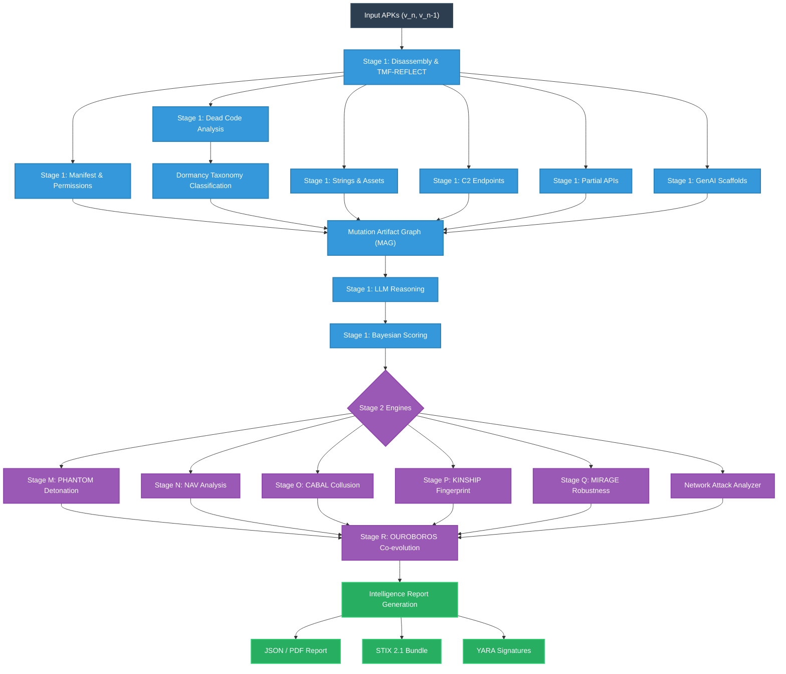

# 🔮 ORACLE-TMF (Temporal Mutation Forecaster)

Observational Reasoning and Coercive Analysis for Latent Evolution.

**ORACLE-TMF** is an advanced malware analysis pipeline and forecasting engine designed to extract mutation artifacts from Android APKs and predict their next evolutionary steps. By treating malware as an evolving biological organism, ORACLE-TMF extracts "dormant" DNA and structural scaffolding to predict what features the malware authors will weaponize in their next release.

---

## 🏗️ Architecture Flowchart

The ORACLE-TMF pipeline is divided into two primary stages: **Stage 1 (Artifact Extraction & Forecasting)** and **Stage 2 (Advanced Intelligence Engines)**.



---

## 🔬 Core Capabilities (Stage 1)

ORACLE-TMF employs a 12-stage pipeline to dissect Android applications and extract subtle artifacts across a **7-Class Taxonomy**:

1. **Dead Code & Unreachable Methods (DTE Engine)**
   - Extracts unexecuted Smali paths and classifies them via the Dormancy Taxonomy Classification (DTE) engine using an XGBoost model.
   - Differentiates between benign remnants, developer scaffolding, and malicious logic bombs.
2. **Unused Permission Intents**
   - Identifies permissions requested in the `AndroidManifest.xml` that are never called by the application’s components, revealing future capability aspirations.
3. **Placeholder Strings & Resources**
   - Mines the APK for high-entropy or anomalous placeholder strings (e.g., `TODO`, `STAGING_URL`, internal IP ranges) often left behind during malware development.
4. **C2 Endpoint Stubs**
   - Extracts orphaned or inactive Command & Control (C2) endpoints, including Tor `.onion` addresses and raw IPv4s.
5. **Partial API Implementations**
   - Detects incomplete API interfaces that hint at future data exfiltration or device control capabilities.
6. **Unfinished UI Flows**
   - Spots orphaned UI layouts and XML resources (e.g., hidden banking phishing screens or overlay attacks).
7. **GenAI API Scaffolds (TMF-Psi)**
   - Detects AI-augmented malware scaffolds, indicating the use of Generative AI tools (e.g., OpenAI, Anthropic, Gemini) by malware authors for dynamic payload generation.

---

## 🧠 Advanced Intelligence Engines (Stage 2)

ORACLE-TMF’s Stage 2 pipeline introduces deep research engines designed to attack, fingerprint, and trace the malware's evolution.

### 📉 Negative Artifact Vectors (NAV)
Analyzes "dropped" or removed artifacts between version $v_{n-1}$ and $v_n$. By observing what malware authors remove, NAV detects tactical shifts, evasion strategies, and abandoned development branches.

### 🧬 KINSHIP Fingerprinting (Builder DNA)
Extracts morphological traits (OpCode frequencies, structural patterns) to construct a "Builder DNA Vector" (BDV). KINSHIP calculates cosine similarity against a database of known Threat Actor profiles to cluster malware samples by their origin.

### 🛡️ MIRAGE Robustness Evaluation
A red-teaming capability that scores the robustness of the ORACLE-TMF pipeline itself. MIRAGE simulates adversarial perturbations against the extracted artifacts and evaluates the injection costs required for an attacker to bypass the system.

### 🕸️ CABAL Collusion Engine
An opt-in engine that detects multi-APK collusion. CABAL analyzes communication bridges (e.g., shared intents, content providers, SMS bridges) to construct cross-app artifact graphs, revealing syndicates of collaborating applications.

### 👻 PHANTOM Detonation Engine
An active deception engine for safe, simulated malware detonation. PHANTOM creates a hyper-realistic, stateful Android environment using Frida. It generates mathematically valid device personas (Luhn-compliant IMEIs, realistic sensor noise, and behavioral biometrics like typing cadence) to defeat anti-analysis and sandbox-evasion checks.

### 🌐 Network Attack Analyzer
Detects advanced network-layer threats embedded within the application, such as Domain Generation Algorithms (DGA), DDoS attack vectors (e.g., SYN floods), and botnet clustering. It outputs Suricata rules and STIX indicators for immediate deployment to firewalls.

### 🐍 OUROBOROS Co-evolution Loop
An advanced research module designed for continuous co-evolutionary refinement. OUROBOROS trains the forecasting models using historical feedback, allowing ORACLE-TMF to adapt alongside the malware authors.

---

## 🎯 Evolutionary Mutation Forecasts

Instead of just telling you what the malware *does*, ORACLE-TMF tells you what it will do *next*.

- **Evolutionary Timeline**: Visualizes the historical ($v_{n-1}$), current ($v_n$), and predicted next version ($v_{n+1}$) of the malware.
- **Bayesian Confidence Scoring**: Computes a strict confidence score for each prediction. By combining LLM-derived probabilities, artifact density across the MAG (Mutation Artifact Graph), and empirical prior weights, the Bayesian scorer filters out low-confidence hallucinations and promotes highly probable evolutionary jumps.

---

## 📤 Export & Integration

ORACLE-TMF seamlessly exports its intelligence products for SOC and Threat Intel integration:
- **Comprehensive JSON Report**: The full Mutation Artifact Graph (MAG) and executive summary.
- **Proactive YARA Rules**: Signatures generated not for the current malware, but for the predicted $v_{n+1}$ payload.
- **STIX 2.1 Bundle**: A TAXII-compatible threat intelligence feed containing actionable indicators (C2 IPs, domains, hashes).
- **PDF Intelligence Brief**: A beautifully formatted, human-readable report for C-suite and SOC analysts.

---

## 🚀 Setup and Usage

### Prerequisites
- Python 3.10+
- `apktool` (Ensure it is installed and available in your system `PATH`)
- `java` (Required for apktool)

### Installation

1. **Clone the repository:**
   ```bash
   git clone https://github.com/Saksham-Shreyans/ORACLE_TMF.git
   cd ORACLE_TMF
   ```

2. **Install dependencies:**
   ```bash
   pip install -r requirements.txt
   ```

3. **Configure API Keys (Optional but Recommended):**
   ORACLE-TMF relies on LLMs for reasoning. Set your API keys in `.env` or as environment variables:
   ```env
   OPENAI_API_KEY=your_key_here
   ANTHROPIC_API_KEY=your_key_here
   GEMINI_API_KEY=your_key_here
   ```

### Running the Dashboard

Launch the interactive Streamlit dashboard:
```bash
streamlit run app.py
```

### Analysis Workflow

1. **Upload Targets**: Open the web interface and upload the **Target APK** ($v_n$).
2. **Version Diffing**: *(Optional)* Upload the **Previous Version APK** ($v_{n-1}$) to enable NAV drop detection and evolutionary diffing.
3. **Configure Stage 2**: Use the sidebar to toggle specific Stage 2 modules (KINSHIP, MIRAGE, PHANTOM, etc.).
4. **Execute**: Run the analysis and view the generated intelligence products directly in the browser.

---

## 🛡️ License and Disclaimer
ORACLE-TMF is designed for security research, threat intelligence, and defensive purposes. Use responsibly.
